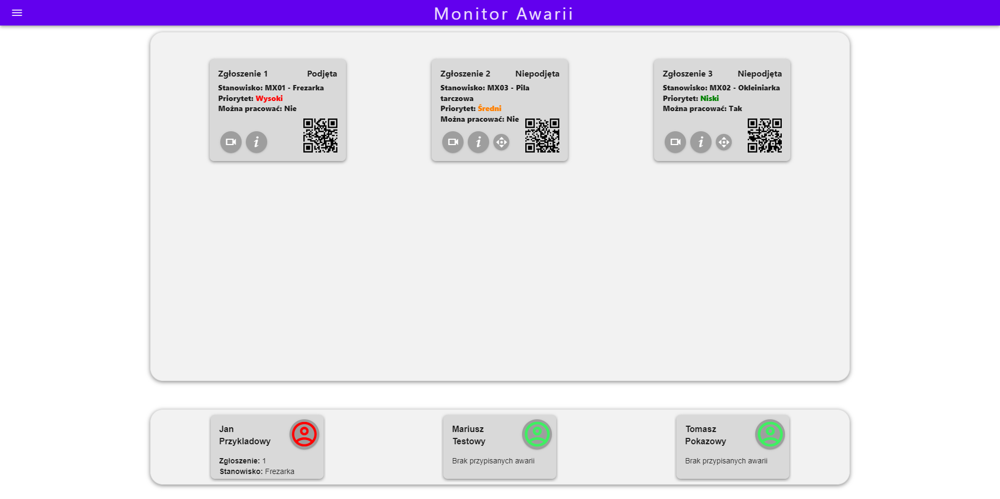
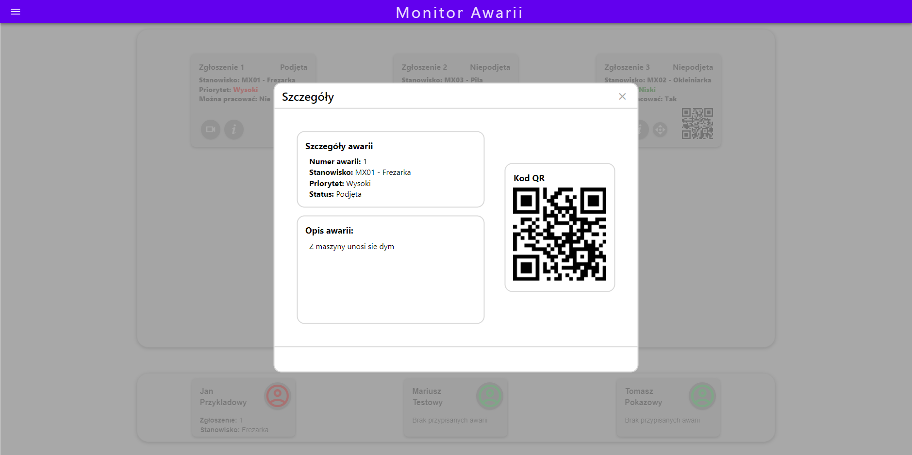
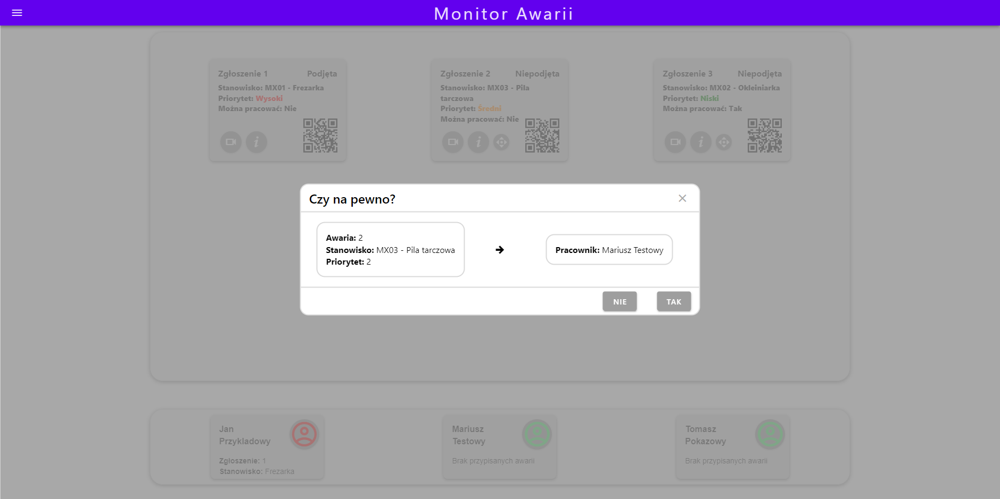
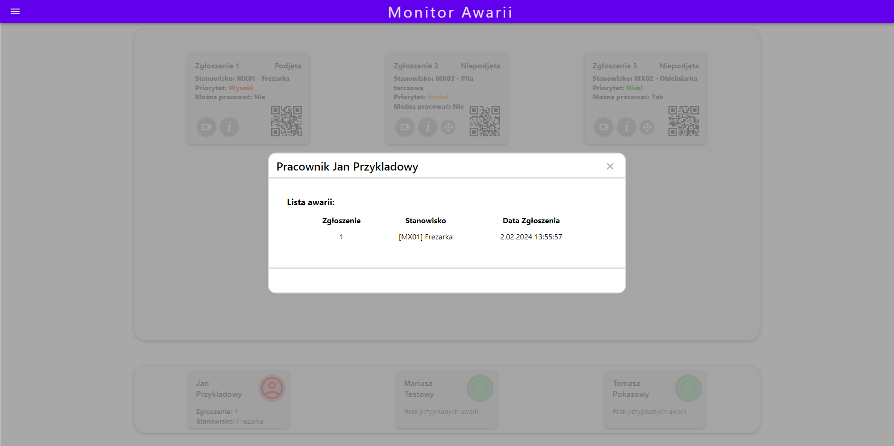
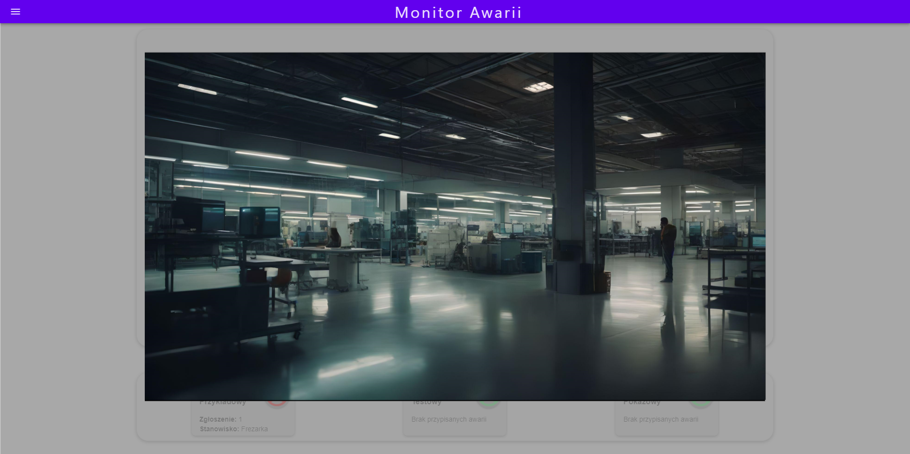

  <h1 align="center">🖥️ Malfunction monitor</h1>

  

    The project was developed as part of the "Team Project" course at the university.
     
    
  

 

## About the project

  This is a part of a bigger project made by 4 teams. The web application is designed to monitor machine malfunctions in a production hall. 
  The application allows users to assign malfunction to worker by drag and drop functionality. 
  User can also display image from a camera next to the position. Besides the monitoring application, we developed a common REST API for all teams.

## Built with
 [![Vue][Vue.js]][Vue-url]
 [![JS][JavaScript]][JavaScript-url]
 [![Nest][NestJS]][NestJS-url]
 [![Typescript][TypeScript]][TypeScript-url]
 [![MSSQL][MSSQLServer]][MSSQLServer-url]

[Vue.js]: https://img.shields.io/badge/Vue.js-35495E?style=for-the-badge&logo=vuedotjs&logoColor=4FC08D
[Vue-url]: https://vuejs.org/
[JavaScript]: https://img.shields.io/badge/JavaScript-F7DF1E?style=for-the-badge&logo=javascript&logoColor=black
[JavaScript-url]: https://www.javascript.com
[NestJS]: https://img.shields.io/badge/-NestJs-ea2845?style=for-the-badge&logo=nestjs&logoColor=white
[NestJS-url]: https://nestjs.com
[TypeScript]: https://img.shields.io/badge/TypeScript-007ACC?style=for-the-badge&logo=typescript&logoColor=white
[TypeScript-url]: https://www.typescriptlang.org
[MSSQLServer]: https://img.shields.io/badge/Microsoft%20SQL%20Server-CC2927?style=for-the-badge&logo=microsoft%20sql%20server&logoColor=white
[MSSQLServer-url]: https://www.microsoft.com/en-us/sql-server

## Screenshots

  
  
  
  
  
  

